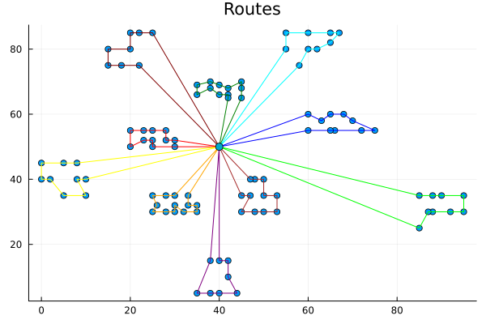
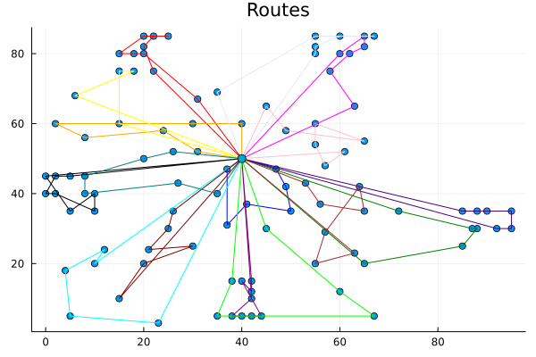
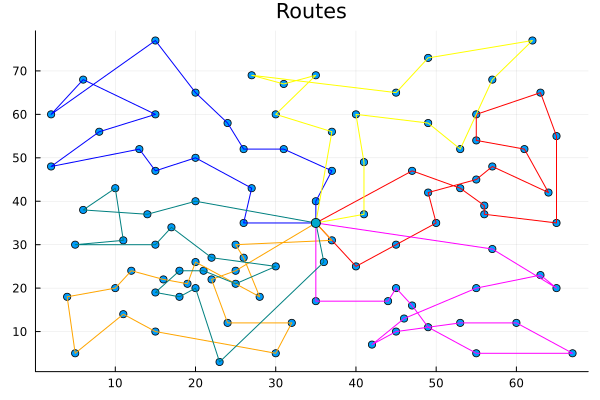

# 🏥 Optimizing Home-Care Service Routing using a Genetic Algorithm

Implementation of a **Genetic Algorithm (GA)** to solve a simplified **Capacitated Vehicle Routing Problem with Time Windows (CVRPTW)** applied to home-care nurse scheduling.

This project was developed for the course:

**IT3708 – Bio-Inspired Artificial Intelligence**
Department of Computer Science – Spring 2025

Author: **Tanguy Guyot**

---

## 📌 Problem Overview

This project tackles a variant of the **Home-Care Vehicle Routing Problem (HCVRP)**.

A set of nurses must:

* Start from a central depot
* Visit assigned patients
* Respect strict **time windows**
* Respect **capacity constraints**
* Return to the depot before a given deadline

### 🎯 Objective

Minimize:

> **Total travel time across all nurses**

⚠️ Travel time only — waiting time and care time are NOT included in the objective, but are considered for constraint validation.

---

## 🧠 Problem Characteristics

Each instance contains:

* A single depot
* Multiple nurses (same capacity)
* Patients with:

  * Demand (workload)
  * Care time
  * Time window [start, end]
  * Coordinates
* Travel time matrix

### Constraints

1. Each patient must be visited exactly once
2. Total route demand ≤ nurse capacity
3. Visits must respect time windows
4. Return to depot before deadline
5. All routes start at time 0

---

# 🧬 Genetic Algorithm Design

The algorithm was implemented in **Julia 1.11**.

It follows a modular architecture:

```
structures.jl
utilitaries.jl
initialization.jl
crossover.jl
mutations.jl
selections.jl
local_search.jl
```

---

## 🧱 Solution Representation

Each individual is represented as:

```julia
Vector{Vector{Int}}
```

Each inner vector = route of a nurse
Each integer = patient ID

Additional stored attributes:

* travel_time
* score (travel time + penalties)
* penalties
* feasibility

---

## 🏋️ Fitness Function

The evaluation computes:

```
score = travel_time + penalty_factor × constraint_violations
```

Penalties applied for:

* Capacity overflow
* Late return to depot
* Late arrival after time window

Early arrival is handled as **waiting time**, not penalized.

Adaptive penalty mechanism adjusts pressure toward feasibility dynamically.

---

# 🧪 Population Initialization

To improve exploration, multiple initialization strategies were used:

### 1️⃣ Position-based clustering

* KMeans on patient coordinates

### 2️⃣ Time-window clustering

* KMeans on:

  * Window midpoint
  * Window size

### 3️⃣ Fully random individuals

---

# 🔀 Genetic Operators

## Selection

* Tournament selection

## Crossover

Route-based crossover (inspired by Visma kickoff slides):

1. Select random non-empty route in each parent
2. Remove route patients from other child
3. Repair by reinserting missing patients optimally

## Mutations

* Swap mutation
* Shuffle mutation
* Insert mutation
* Split route
* Merge routes

Mutation rate: **0.15**

---

# 🏝 Island Niching Strategy

The algorithm runs 3 independent configurations:

* 30% cluster / 70% random
* 70% cluster / 30% random
* 100% time-window cluster

Final step:

* Merge populations
* Run final GA phase

This improved final results consistently.

---

# ⚡ Performance Optimizations

* Multi-threaded crossover & mutation (`Base.Threads`)
* Local search every 5 generations
* Diversity injection if stagnation > 5 generations
* Elitism (30%) + tournament survivor selection

---

# 📊 Results

## ✅ Test Instance 0

* Benchmark: 826
* Obtained: **828.94**
* Within **5% benchmark**



---

## ✅ Test Instance 1

* Benchmark: 1514
* Obtained: **1659.14**
* Within **10% benchmark**



---

## ✅ Test Instance 2

* Benchmark: 900
* Obtained: **953.41**
* Within **10% benchmark**



---

# 🎞 Evolution of a Route (GA Progress)

The following animation shows how a route evolves during the genetic optimization process:


---

# 🖥 Hardware & Software

### Hardware

* CPU: Intel i5-1135G7
* RAM: 8GB
* OS: Windows 11

### Software

* Julia 1.11
* VS Code
* Libraries:

  * JSON
  * Random
  * Plots
  * Clustering
  * Base.Threads

---

# 📁 Project Structure

```
.
├── src/
│   ├── structures.jl
│   ├── initialization.jl
│   ├── crossover.jl
│   ├── mutations.jl
│   ├── selections.jl
│   ├── local_search.jl
│
├── instances/
├── images/
│   ├── test0.png
│   ├── test1.png
│   ├── test2.png
│   ├── evolution.gif
│
└── README.md
```

---

# 🚀 How to Run

```bash
julia main.jl instance.json
```

The algorithm will:

* Log best score per generation
* Output best solution
* Generate route plot

---

# 🏁 Conclusion

The genetic algorithm successfully:

* Respected all constraints
* Achieved benchmark-level performance
* Demonstrated robustness across instances

Future improvements could include:

* More advanced local search (2-opt, Or-opt)
* Smarter adaptive penalty tuning
* Hybrid metaheuristics (GA + Tabu Search)

This project demonstrates how evolutionary algorithms can effectively solve complex, real-world constrained optimization problems.
